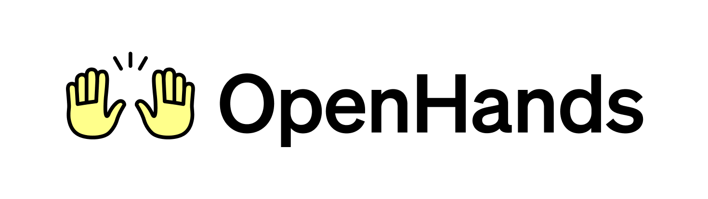
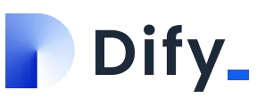
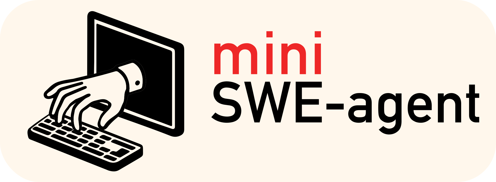

# LLM Related Teches

[github-badge]: https://img.shields.io/badge/github-repo-blue?logo=github
[paper-badge]: https://img.shields.io/badge/Paper-B31B1B?style=flat&logo=arxiv&logoColor=white

## Agentic systems

### Applications

| Application | Link | Description |
| --- | --- | --- |
| Pixel2Motion | [![GitHub][github-badge]](https://github.com/nolangz/pixel2motion) | AI Logo Animation Skill |
| Awesome LLM Apps | [![GitHub][github-badge]](https://github.com/Shubhamsaboo/awesome-llm-apps) | 100+ AI Agent & RAG apps you can actually run |
| OpenMontage | [![GitHub][github-badge]](https://github.com/calesthio/OpenMontage) | The first open-source, agentic video production system. |

### Memory

| Item | Link | Description |
| --- | --- | --- |
| Memo: Memory as a Model | [![Paper][paper-badge]](https://arxiv.org/pdf/2605.15156) | MeMo augments any LLM with up-to-date or domain-specific knowledge via a trained memory model, avoiding costly retraining, mitigating catastrophic forgetting, and remaining robust to retrieval noise |
| Memvid | [![GitHub][github-badge]](https://github.com/memvid/memvid) | Memvid is a single-file memory layer for AI agents with instant retrieval and long-term memory. |
| Obsidian-skills | [![GitHub][github-badge]](https://github.com/kepano/obsidian-skills) | Agent Skills for use with Obsidian. |
| Headroom | [![GitHub][github-badge]](https://github.com/headroomlabs-ai/headroom) | Headroom compresses everything your AI agent reads — tool outputs, logs, RAG chunks, files, and conversation history — before it reaches the LLM. Same answers, fraction of the tokens. |
| codebase-memory-mcp | [![GitHub][github-badge]](https://github.com/DeusData/codebase-memory-mcp) | The fastest and most efficient code intelligence engine for AI coding agents. |

### Harness

| Item | Link | Description |
| --- | --- | --- |
| 🦌 DeerFlow - 2.0 | [![GitHub][github-badge]](https://github.com/bytedance/deer-flow) | DeerFlow (Deep Exploration and Efficient Research Flow) is an open-source super agent harness that orchestrates sub-agents, memory, and sandboxes to do almost anything — powered by extensible skills. |
| | [![GitHub][github-badge]](https://github.com/OpenHands/agent-canvas) | The self-hosted developer control center for coding agents and automations. |
|  | [![GitHub][github-badge]](https://github.com/langgenius/dify) | Dify is an open-source LLM app development platform. Its intuitive interface combines AI workflow, RAG pipeline, agent capabilities, model management, observability features and more. |
|  | [![GitHub][github-badge]](https://github.com/SWE-agent/mini-swe-agent/) | The minimal AI software engineering agent. |
|  | [![GitHub][github-badge]](https://github.com/flowiseai/flowise) | Build AI Agents, Visually |
|  | [![GitHub][github-badge]](https://github.com/pewdiepie-archdaemon/odysseus) | A self-hosted AI workspace for chat, agents, research, documents, email, notes, calendar, and local model workflows. |
